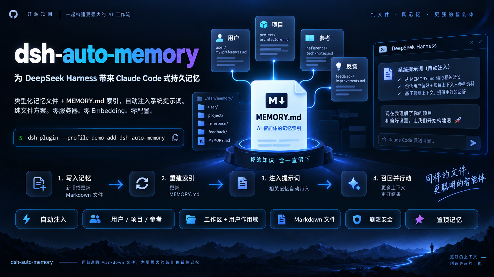

# dsh-auto-memory

[](https://github.com/AskTheWay/dsh-auto-memory/actions/workflows/ci.yml)
[](https://www.npmjs.com/package/dsh-auto-memory)
[](https://www.npmjs.com/package/dsh-auto-memory)
[](LICENSE)
[](package.json)

[English](README.md) | [中文](README.zh.md)

> ### 你的 dsh 智能体把你说过的每件事都忘掉。每一次。每一个会话。
> **一条命令修复。** 把 Claude Code 式持久记忆带给
> [DeepSeek Harness](https://github.com/deepseek-ai/deepseek-harness)——原生实现,
> 零服务器、零 embedding、零配置。

```sh
dsh plugin --profile demo add dsh-auto-memory
```

今天对它说 *"记住:我是准备面试的 Python 后端工程师"*——
明天开一个全新会话,问 *"你对我有什么了解?"*,它**记得**。



---

## 0.7.0 新增(P3)

- **更新替换语义**:固化不再让同一事实的新旧版本并存。name 锚定匹配器
  (前缀容错、词序无关——`ignore-err-x` 命中 `err-x-ignore`)加上描述复述
  匹配,命中即**原地更新**(复用现有 name/scope 与生命周期),不再跳过或
  重复;固化 prompt 同时指导模型更新时复用现有 name。
- **匹配核心与评测共用**(`src/matching.ts`):L3 验证过的映射机制成为
  产品与 runner 的单一实现点——评测方法学反哺产品,第三次兑现。
- **L3 新指标——重复(未替换)**:同一金标仍有多条产物 = 并存未替换。
  变更后:mini 0(原 1)、standard 产物 26→25(余 2)、mini 精确率
  70→87.5%;standard 召回单次运行为 75%——如实记录,运行间方差未测。
- **面板 UX 整体优化**:顶部总览(总数/置顶/停用/预算条)、类型彩色徽章
  (user/feedback/project/reference)、搜索过滤、相对时间("3 天前")、
  图标操作(✏️📌🔇🗑)、空状态三步引导、每组摘要行、当前工作区 ✅ 标记。

## 0.6.0 新增(P2)

- **harness-sessions 评测数据集**(`evals/datasets/`):合成多会话开发者剧本
  + 金标事实(durable / ephemeral 陷阱 / updated 推翻标签、evidence 会话、
  拒答题)——公开基准都不覆盖的 coding-agent 记忆场景。
- **L1 注入召回**(零 API runner):两个数据集在完美固化上界下均 100%——
  注入侧零损耗。
- **L3 固化质量**(每会话一次 LLM 调用,与插件同一条固化代码路径):
  **mini 召回 100% / 更新正确率 100% / 污染 0%;standard 召回 83.3% /
  精确率 84.6% / 更新正确率 100% / 污染 0%**(deepseek-chat,temperature 0)。
  ephemeral 陷阱在每轮运行中都被正确拒绝。
- **评测反哺的产品修复**:固化描述现在跟随会话语言(中文会话曾固化出
  英文记忆——先测出,后修复)。
- 社区贡献:软停用(保留与删除之间的第三档,#10)、面板当前工作区修复
  (#9)、中文 bigram 回声去重(#5)、编辑器 busy/错误 UX(#8)、身份证
  校验位前置验证(#7)。

## 0.5.0 新增(P2)

- **三因子排序**(Generative Agents 公式的免 embedding 版):注入索引与
  memory_list 按 置顶 → importance×recency(0.995^天,天粒度保证当日文本
  稳定、不破坏 KV 前缀缓存)排序;自动固化时模型为每条记忆打 1-10 重要度,
  类型自带缺省。
- **安全包**:所有写入路径统一过脱敏([REDACTED:github-token/npm-token/
  openai-key/aws-key/手机号/身份证]——正是本项目历史里真实泄漏过的形态)
  与协议标签转义——注入段包 <memory_context> 壳,内容无法伪造壳;固化按
  描述相似度(Jaccard ≥ 0.7)去重,不再堆积回声。
- 评测叙事闭环:半量预算压力下探针保留率 38%(位置式)→ 80%(置顶)
  → **≥90%(三因子,未置顶)**——同预算同 seed,更对的记忆。

## 0.4.0 新增(P2)

- **Web UI 记忆面板**(上方截图):双半插件——宿主半在认证围栏内注册
  `/api/auto-memory/*` 路由(复用带锁 store),浏览器半注册侧栏入口与管理页
  (按作用域分组的列表,含类型/置顶/读取计数;容量条与预算预警;行内编辑、
  置顶切换、确认删除)。一套 bundle 同时服务 Web 与桌面端;非 Web 组合自动 no-op。
- 面板修复:路由改经 connection 就绪回调注册(此前被宿主加载顺序跳过);
  编辑器改用官方主题变量(`--dsw-alias-*`)——深色模式可读。
- 包卫生:浏览器半以 `lib/client.js`(17 kB)随 `dsh.client` manifest 分发;
  总安装体积约 32 kB,运行时零依赖。

## 0.3.0 新增(P2)

- **置顶记忆**(memory_write 传 `pinned: true`):置顶条目排在索引最前、
  在预算截断中优先保留、豁免软淘汰——用户可控的信任锚点。
- **评测驱动修复**:注入预算语义改为覆盖整段(索引+指导文本);旧实现会
  超支 ~800 字节——由新评测层首跑即抓出。
- **确定性评测层**([evals/](evals/README.md))进 CI:注入预算曲线、淘汰
  零误杀、链接展开边界、信噪比 characterization——pinned 优先截断把
  半量预算下的探针保留率从 **38% 提升到 ≥80%**。同样的预算,更对的记忆。

## 0.2.0 新增(P1)

- **自动固化**(`autoSummarize: true`):根会话结束时,后台 LLM 从会话中提取
  值得长期保留的新事实并写入记忆——查重、限量、失败静默。Claude Code 没有全自动。
- **遗忘与淘汰**:每条记忆携带生命周期元数据(created/updated/reads);
  `memory_read` 累计引用;`staleAfterDays` 把零引用超龄记忆从注入索引软隐藏
  (文件保留);`memory_prune` 列出(dry-run)或删除高龄记忆。
- **召回展开**:`memory_read` 解析一层 `[[name]]` 交叉链接并附摘要。
- `memory_delete_all`——由 `tools/pre-execute` **人工审批**把关:
  模型无法自证通过不可逆批量删除。
- 经第二轮对抗审查(11 个智能体)加固:clear 单锁窗口(并发写不逃逸)、
  touch 条件重建(消除 O(N) 放大)、会话启动刷新软淘汰、子代理缓冲清理、
  固化可中止。

工具:`memory_write` / `memory_read` / `memory_list` / `memory_delete` /
`memory_prune` / `memory_delete_all`。

## Claude Code 有的东西,dsh 一直没有。现在有了。

DeepSeek Harness 是当下 GitHub 最火的开源智能体框架——模型、工具、沙箱,万物皆插件。
但它**根本没有记忆子系统**。官方的答案是三份*默认关闭*的 MCP 外挂配置,而且官方文档
自己承认局限:不自动注入、无遗忘策略、只做子串搜索。你的智能体是**设计层面的失忆症**。

`dsh-auto-memory` 用原生实现补上这个缺口:

| | MCP 外挂方案 | **dsh-auto-memory** |
|---|---|---|
| 记忆自动注入**每一次**系统提示词 | ✗ | ✓(无记忆时零 token 占用) |
| 类型化记忆:user / feedback / project / reference | ✗ | ✓ |
| 工作区 + 用户双层作用域——跨项目不串扰 | ✗ | ✓ |
| 崩溃与并发安全(跨进程锁、孤儿锁自愈) | — | ✓ |
| 需要外部服务 / 数据库 / embedding | ✓✓✓ | **全都不用——纯 Markdown 文件** |

记忆是 `$DSH_HOME/memory/` 下的普通文件——可手改、可 grep、对 git 友好,完全属于你。

## 一分钟感受它

```sh
node scripts/demo.mjs   # 不要 API key、不开浏览器:看 写入 → 索引 → 注入 → 召回 → 遗忘
```

或者在真实对话里:告诉智能体值得记住的事。模型调用
`memory_write` / `memory_read` / `memory_list` / `memory_delete`,
遵循 Claude Code 的写入纪律:**查重更新而非堆积**、只用绝对日期、
`[[name]]` 交叉链接、`feedback` 记忆附 **Why:** / **How to apply:** 行。

## 模型实际看到什么

每个请求,一个系统提示词段(order 4000)携带索引——每步重新求值、字节预算控制、
存储为空时**整段消失**:

```
# Persistent memory index
## Project memories
- [压测过 PostgreSQL](id-generator-benchmark.md) — psycopg2 连接池有踩坑经验 (2026-09)
- [用户是 Python 后端工程师](user-prefers-python.md) — 正在准备面试; 偏好中文交流
```

中文标题、YAML frontmatter、一条记忆一个文件——完整的 Claude Code `MEMORY.md`
模型,在 dsh 的提示词组装管线上原生重建。

## 首发之前就被锤炼过

这个插件在 v0.1.0 发布前经受了一次 **12 个智能体的对抗性代码审查**
(68 万 token 的源码级拷问)。五个生产级陷阱被抓出并修复——全部带回归测试——
其中两个若上线就是事故:

- **NTFS 静默毁数据**:名为 `memory` 的记忆会在大小写不敏感文件系统上撞上
  `MEMORY.md`——写入*报告成功*,实际销毁记录。保留字守卫拦截。
- **毒提示炸弹**:任何记忆里三个字面 `{{{ }}}` 花括号,就能炸掉工作区的
  *每一个*模型请求——且模型无法自救。收敛式消毒器中和。

还有:孤儿锁自愈(Ctrl+C 砸不坏你的记忆库)、symlink 读取防护、坏文件容错、
稳定的索引排序(保住 KV 前缀缓存)、严格不写自定义会话事件(那会让 dsh 会话
拒绝 resume)。

## 用数字说话,不止口头宣称

确定性评测层([evals/](evals/README.md))随 CI 运行——无 LLM、结果完全可复现:

- **注入预算任意规模下成立**:20/50/100/200 条记忆,注入段恒 ≤ 4 KB
  (实测 4065/4048/4018/3940 字节)且带截断标记;空库注入 **0 字节**。
- **淘汰零误杀**:四类混合场景——只有"超龄零引用"被隐藏,文件零丢失,
  读一次即复活。
- **已知局限(有意钉板)**:预算截断目前按索引行序(位置式)而非相关性排序——
  半量预算压力下探针保留率随规模降至 ~38%→10%。**置顶可解关键项**:同预算下
  pinned 探针保留 **≥80%**(0.3.0);完整相关性排序仍在路线图。

评测层已抓到过真实 bug:字节预算曾遗漏指导文本、整段超支 ~800 字节
(已修复并带回归)。

**106 项测试 + 三层评测(L0 确定性/L1 召回/L3 固化质量)。运行时依赖仅 `yaml`。**

## 安装

```sh
dsh plugin --profile demo add dsh-auto-memory   # npm 直装(预构建)
dsh --profile demo                               # 重启 profile 生效
```

源码安装:`npm install && npm run build && dsh plugin --profile demo add /绝对路径`。
要求 `@deepseek-ai/dsh >= 0.1.5-rc.2`(Node `^22.19 || >=24`)。

## 配置

在 profile 的 `cordis.patch.yml` 覆盖(config 整表替换):

```yaml
- id: auto-memory
  config:
    maxBytes: 4096          # 注入预算(索引+指导文本+协议壳)
    memoryDir: D:/memories  # 默认: $DSH_HOME/memory
    enableUserScope: true   # false: 用户层在所有路径禁用
    autoSummarize: false         # true: 根会话结束时后台 LLM 提取持久事实写入
    autoSummarizeMaxMemories: 5  # 单次固化上限
    autoSummarizeMaxTokens: 2048 # 固化输出 token 上限
    staleAfterDays: 0            # >0: 软隐藏超 N 天零引用记忆(文件保留)
```

## 工作原理(60 秒)

- **写入**:工具 `execute` → name 归一化为 `[a-z0-9-]`(保留字拒绝)→
  跨进程文件锁(官方 `dsh-atomic-write`)→ 原子写 → 锁内全量重建索引。
- **注入**:单个动态段,每步组装重新求值;同步读索引、执行字节预算、中和 `{{`。
  工具写入在**下一个请求**即生效——永远不需要重启。
- **审计**:不写自定义会话事件(第三方事件类型会让 dsh 拒绝 resume);
  一切走标准 `tool/call` / `tool/result`。

深度内容:[设计决策](docs/design.md) ·
[复盘:向 awesome-dsh-plugin 提 PR](docs/postmortem-pr-5696.md)

## 路线图

- [x] P0——类型化存储、四工具、提示词注入、分层作用域、崩溃安全
- [x] P1——会话结束自动固化、遗忘与淘汰、召回展开、人工审批的批量删除
- [ ] P2——Web UI 记忆卡片、token 成本/召回质量评测

## 许可

MIT
